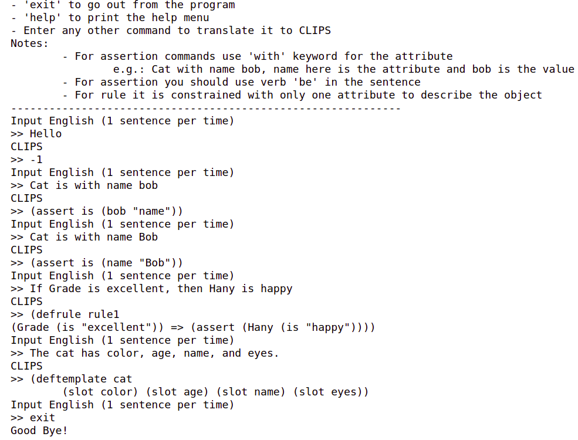

# PAI_Fall21IU
This repository is used to work on my assignments and homeworks in Practical AI course at Innopolis University Fall 2021

## Assignment 1

MinMax bot for two environments:

### Dots environment: [README](https://github.com/hany606/PAI_Fall21IU/tree/main/Assignments/Assignment1/Dots)

### Tiktikl environment: [README](https://github.com/hany606/PAI_Fall21IU/tree/main/Assignments/Assignment1/Tiktikl)

## Assignment 2

English-to-Clips programming language translator [here](https://github.com/hany606/PAI_Fall21IU/blob/main/Assignments/Assignment2/Assignment2.ipynb)

## Assignment 3

Babel Fish (Russian voice -> Russian text -> English text -> English voice) using Nemo from Nvidia: [here](https://github.com/hany606/PAI_Fall21IU/blob/main/Assignments/Assignment3/Assignment3_PAI_Hany_Hamed.ipynb)

## Assignment 4

Track moving cars on road from top view using classical approaches in Computer Vision

